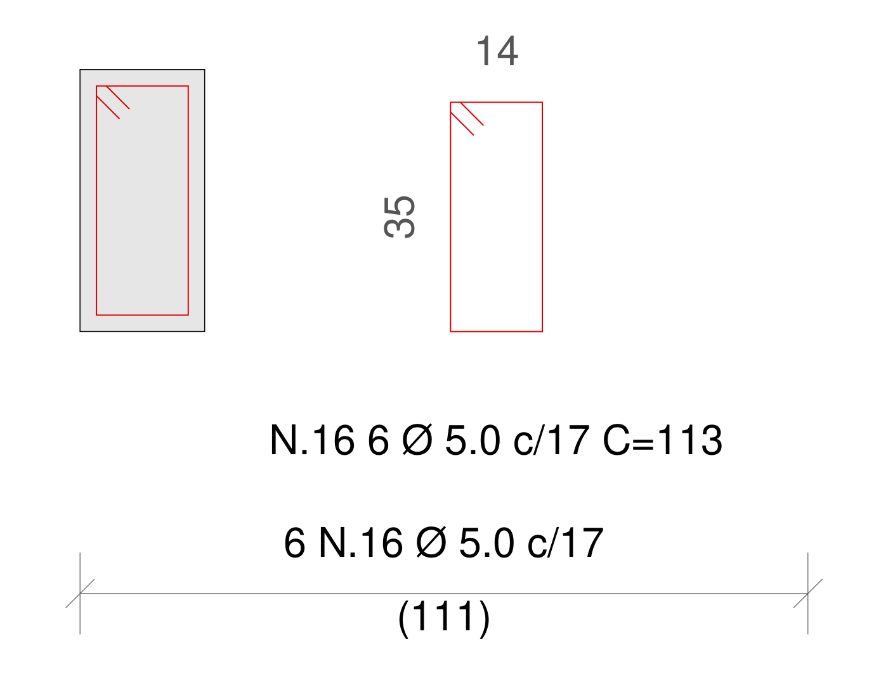
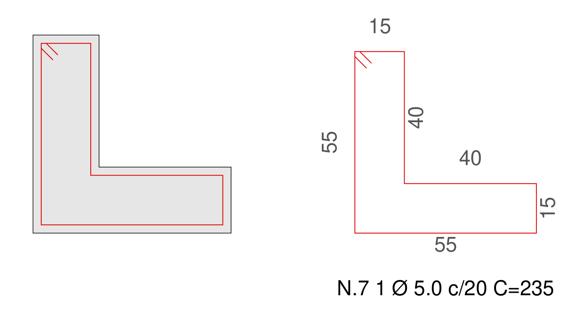
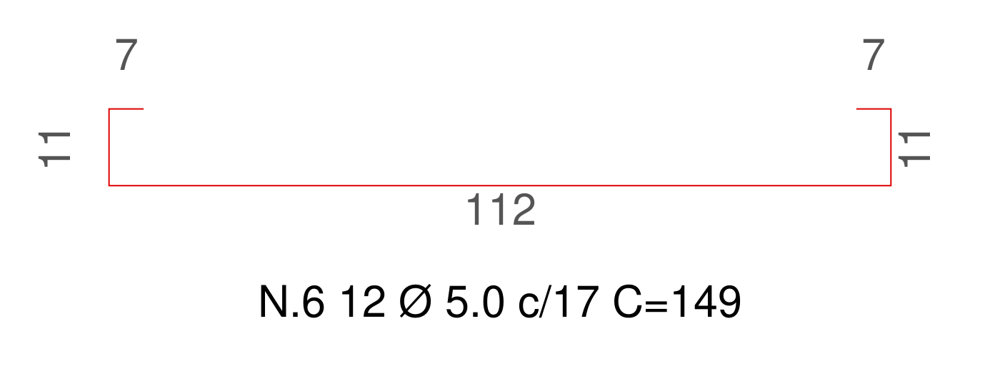
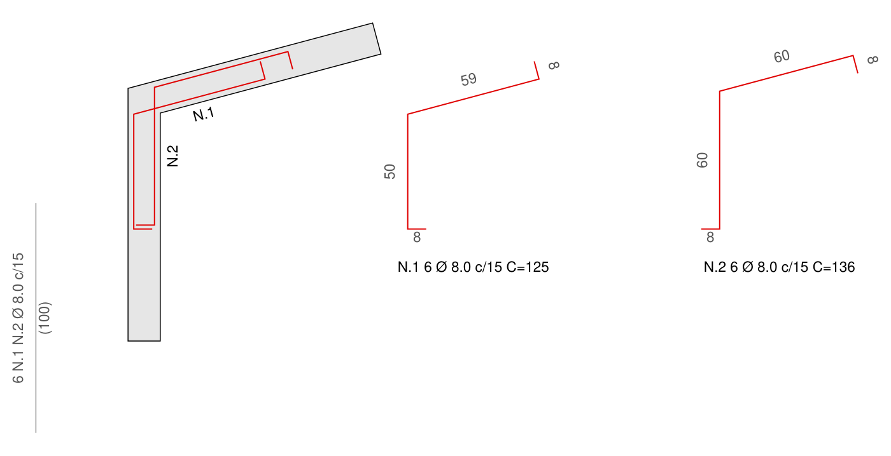

# ESTRIBO.LSP: detalhamento de estribos e de encontro de paredes

Rotina AutoLISP com janelas de edição (DCL) e dois comandos:

- `ESTRIBO` (ou `EST`): desenha o estribo na seção, cria o detalhe cotado ao
  lado e a cota de distribuição, com a nomenclatura no padrão das pranchas
  (ex.: `N.16 6 Ø 5.0 c/17 C=113`).
- `ENCONTRO`: armadura de encontro de paredes em **L cruzados**, para qualquer
  ângulo, evitando o empuxo ao vazio (veja a seção própria mais abaixo).

## Como carregar

1. No AutoCAD: `APPLOAD`, selecione `ESTRIBO.lsp` e clique em **Load**.
   Para carregar sempre, adicione o arquivo ao **Startup Suite** (Contents...).
2. Digite `ESTRIBO` (ou `EST`) ou `ENCONTRO`.

Não precisa de nenhum arquivo `.dcl` separado: a janela é gerada
automaticamente.

## Layers

Os layers são criados automaticamente se ainda não existirem no desenho. Se já
existirem, a rotina não altera nada neles.

| Elemento                                      | Layer          |
|-----------------------------------------------|----------------|
| Barras na seção/planta e nos detalhes         | `EST_ArmPos`   |
| Cotas do detalhe e cota de distribuição       | `EST_Cota`     |
| Identificação (`N.16 6 Ø 5.0 c/17 C=113`)     | `EST_ArmTexto` |

**Textos em Arial:** todos os textos usam o estilo `Arial` (fonte `arial.ttf`),
criado automaticamente se ainda não existir.

**Cota de distribuição:** é uma cota real do AutoCAD (`DIMALIGNED`) no estilo de
cota `EST_Cota`: traço oblíquo, texto Arial alinhado, vírgula decimal e cores
ByLayer. O texto sai como `6 N.16 Ø 5.0 c/17` em cima da linha e `(111)` embaixo.
O `(111)` é o valor medido, então a cota é associativa. Se o estilo `EST_Cota`
já existir no desenho, ele é usado como está. A escala da cota (DIMSCALE) é
ajustada pela escala informada na janela, e o valor sai em cm em qualquer
unidade de desenho. Depois de indicar o trecho, a rotina pede a posição da
linha de cota (Enter = sobre os pontos clicados).

## Janela

**Identificação**
- *Prefixo* e *Posição*: `N.` + `16` resulta em `N.16` (use prefixo `N` para ter `N4`, como na prancha 251).
- *Bitola*: 4.2 / 5.0 / 6.3 / 8.0 / 10.0 / 12.5 / 16.0.
- *Espaçamento c/* e *Quantidade*. Com um *Trecho* informado (ou medido com
  **Medir <**), a quantidade é calculada: `n = int(L/s)` e, se marcado, `+1`.
- *Incluir C=*: acrescenta o comprimento total na identificação do detalhe.

**Tipo de estribo**
- **Padrão**: fechado, pernas a 45° (gancho de 135°).
- **Fechado**: fechado, pernas a 90°.
- **Aberto (U)**: aberto em cima, pernas a 90° para dentro.

**Geometria** (cm, medidas externas do estribo)
- **Genérico**: digite B x H. Sai só o detalhe (e a distribuição, se marcada).
- **Selecionar seção <**: clique na polilinha fechada da seção (pode estar
  dentro de bloco). O estribo é gerado descontando o *cobrimento*, desenhado
  dentro da seção e detalhado ao lado. Funciona com seção retangular ou
  poligonal (L, T, U...).
- **Desenhar estribo <**: clique dois cantos, ou use a opção `Poligono` e
  clique os vértices. O contorno desenhado é o próprio estribo, e B x H são
  medidos automaticamente.
- *Perna* (mínimo **5 cm**) e *Acréscimo de dobra*. No modo automático:
  - 45°: perna = max(5 cm, 5φ); acréscimo = 5φ
  - 90°: perna = max(7 cm, 10φ); acréscimo = 1φ

  (NBR 6118, item 9.4.6.1). Sem o modo automático, qualquer perna ≥ 5 cm é
  aceita e a janela avisa se ficar abaixo do que a norma recomenda.

**Desenho**
- *Unidade* do DWG (cm, m ou mm), *Escala* e *Altura do texto* em mm no papel.
  Exemplo: 2,5 mm a 1:25 em cm dá texto de 6,25.
- Marque o que desenhar: estribo na seção, detalhe cotado, distribuição.
  Se a distribuição estiver marcada e o trecho ainda não tiver sido medido, os
  pontos do trecho são pedidos antes dos detalhes (a quantidade depende dele).
- *Cotas como dimensão*: as cotas do detalhe viram `DIMALIGNED` no estilo
  `EST_Cota` (por padrão são textos no layer `EST_Cota`, como nas pranchas).

A caixa **Resultado** mostra, em tempo real, B x H, o comprimento C, o peso e
como a identificação vai sair.

## Comprimento do estribo

```
Fechado : C = perímetro externo + 2 x (perna + acréscimo)
Aberto  : C = perímetro sem o lado aberto + 2 x (perna + acréscimo)
```

O resultado é arredondado para cima, em cm inteiros. Exemplo: estribo 14 x 35,
Ø 5.0, pernas a 45° dá 98 + 2 x (5 + 2,5) = **113**, igual à prancha
1222-EC-PR-PIEM-VES-251.

## Saída (exemplos)

Seção 19 x 40 selecionada (cobrimento 2,5), com distribuição medida de 111 cm c/17:



Seção poligonal em L:



Estribo aberto (U):



## ENCONTRO: armadura de encontro de paredes (L cruzados)

Para cantos de paredes em qualquer ângulo, como o encontro PAR101 x PAR104.
Cada barra vem pela **face interna** da sua parede, atravessa o encontro até a
**face externa** da outra parede e dobra ao longo dela (ancoragem). São duas
armaduras separadas que se cruzam, e nenhuma dobra no canto interno, o que
evita o empuxo ao vazio.

- **Barra 1**: face interna da parede 1 → face externa da parede 2
- **Barra 2**: face interna da parede 2 → face externa da parede 1
- Ganchos a 90° nas pontas, voltados para a face oposta da parede.

**Janela**
- *Identificação*: prefixo, posição das duas barras (N.1 e N.2), bitola
  (padrão 8.0), espaçamento, quantidade e trecho. **Medir <** mede o trecho no
  corte e calcula a quantidade (`int(L/s)`, com opção `+1`).
- *Paredes*: **Selecionar encontro <** pede, no desenho:
  1. o canto **externo** do encontro;
  2. um ponto na face externa da parede 1;
  3. um ponto na face externa da parede 2;
  4. o canto **interno** do encontro.

  Com isso a rotina mede as espessuras e o ângulo. Em **Genérico** você digita
  espessuras e ângulo e sai só o detalhe.
- *Barras* (cm, medidas externas): perna e ancoragem de cada barra, e gancho
  (automático = 10φ, mínimo 5 cm).
- *Resultado*: C de cada barra, peso e avisos. Um dos avisos aparece se a perna
  não for longa o suficiente para atravessar o encontro; a rotina calcula essa
  largura e mostra o mínimo.

**Saída**
- Barras na planta, com o nome (`N.1`, `N.2`) ao lado de cada uma (só quando o
  encontro é selecionado). Na planta, o gancho é limitado à espessura livre da
  parede.
- Detalhe cotado de cada barra, no ângulo real, com `N.1 6 Ø 8.0 c/15 C=125`
  embaixo.
- Cota de distribuição no corte: `6 N.1 N.2 Ø 8.0 c/15` e `(100)`.

`C = perna + ancoragem + 2 x gancho`, arredondado para cima.

Exemplo com paredes de 14 cm a 105°:



## Observações

- As configurações da janela ficam salvas entre usos (variável `ESTRIBO_CFG`).
- Tudo é feito em um único *undo*: um `U` desfaz o comando inteiro.
- Trechos em arco da polilinha são tratados como retos (a rotina avisa).
- Os ganchos ficam no canto superior esquerdo do estribo.
